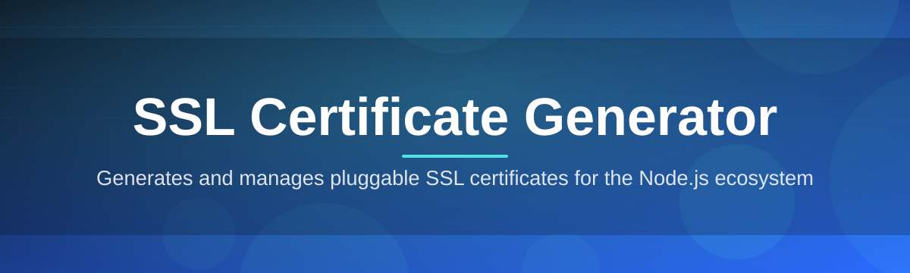
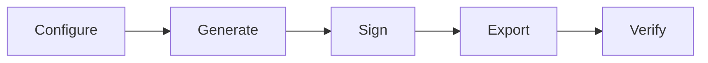

# ssl-certificate-configurator 🔐⚙️

  

*Point, click, and walk away with a fully configured SSL certificate — no OpenSSL incantations required.*

## 🌱 Overview

Somewhere around 2 a.m. on a random Saturday, I got tired of context-switching between four terminal tabs just to spin up a self-signed certificate for a local dev server. Every time I needed an SSL certificate for testing, staging, or some weird internal tool, I'd re-Google the same OpenSSL flags, forget the SAN syntax again, and lose twenty minutes I didn't have. So I built **ssl-certificate-configurator** — a native Windows app that turns SSL certificate generation into a five-click experience instead of a command-line archaeology dig.

This tool isn't trying to replace a full-blown certificate authority or a production ACME client. It's the missing middle layer: a **desktop SSL certificate generator and configurator** for developers, sysadmins, homelab tinkerers, and QA engineers who need trustworthy-looking certificates *right now* without spinning up infrastructure. Think local HTTPS testing, internal reverse proxies, IoT device provisioning, or just learning how certificate chains actually work without fighting a CLI that judges you silently.

Under the hood it still respects the real cryptographic standards — RSA and ECDSA key generation, X.509 v3 extensions, proper Subject Alternative Names, configurable key usage flags — but wraps all of it in a UI that doesn't require you to remember a single flag. Whether you're generating a root CA for a lab network or a leaf certificate for `localhost:3000`, this app treats certificate configuration like a form, not a ritual.

  

  

---

## 🧬 What It Actually Does

<strong>Click to expand the full capability list</strong>

 

- **Instant self-signed certificate generation** — pick your common name, SANs, and validity window, and get a working `.pem`/`.pfx` pair in seconds. No CA bureaucracy, no rate limits.

- **Custom Root & Intermediate CA builder** — build your own miniature certificate authority for internal networks, then issue leaf certs signed by it. Great for homelabs and staging environments that shouldn't touch a public CA.

- **RSA and ECDSA key support** — toggle between 2048/4096-bit RSA or P-256/P-384 elliptic curve keys depending on whether you want compatibility or speed.

- **SAN (Subject Alternative Name) wizard** — add multiple domains, wildcards, and IP addresses through a checklist UI instead of hand-typing OpenSSL config blocks.

- **Export format flexibility** — spit out PEM, DER, PFX/PKCS#12, or a combined bundle depending on what your webserver, load balancer, or IoT firmware actually wants.

- **Certificate inspector** — drag in any existing `.crt` or `.pem` file and get a readable breakdown of issuer, expiry, fingerprint, and extensions. No more squinting at `openssl x509 -text`.

- **Expiry & renewal reminders** — set a local reminder so your self-signed cert doesn't quietly expire mid-demo and ruin your afternoon.

- **Batch generation mode** — need fifty test certificates for a fleet of dev VMs? Configure once, generate in bulk.

> [!TIP]
> If you're building internal tooling that needs HTTPS everywhere (service meshes, local reverse proxies, dev containers), the Root CA builder + batch mode combo will save you hours over the lifetime of a project.

---

## 🚀 Getting Off the Ground

1. Visit the landing page using the download button above or below.

2. Grab the latest standalone build — it's a single executable, no installer wizard to babysit.

3. Run it. Windows SmartScreen may grumble the first time since the binary isn't code-signed with a paid certificate yet — click "More info → Run anyway."

4. Pick a template (self-signed, CA-signed, or import existing), fill out the form, and hit **Generate**. Your certificate and key land in the output folder you chose.

> [!NOTE]
> No admin rights are required for basic certificate generation. You'll only need elevation if you choose to install a generated Root CA into the Windows Trust Store.

---

## 💻 System Requirements

| Requirement | Details |
|---|---|
| OS | Windows 10 (1809+) or Windows 11 |
| Architecture | x64 (ARM64 build in progress) |
| Dependencies | None — fully self-contained, no runtime install |
| Disk space | ~45 MB |
| Internet | Not required after download — everything runs locally |
| Admin rights | Optional, only for trust-store installation |

> [!IMPORTANT]
> This app never phones home. Certificate generation, key material, and everything else stays entirely on your machine. There's no telemetry silently uploading your private keys anywhere — that would be an insane thing to ship.

---

## 🧭 How It Works

The workflow is intentionally linear so you always know exactly what's happening to your key material:

1. **Configure** — choose certificate type, algorithm, validity period, and SAN entries.
2. **Generate** — the app creates the key pair locally using standard cryptographic libraries.
3. **Sign** — either self-signed or chained against a Root/Intermediate CA you've built.
4. **Export** — output is written in your chosen format(s) to a folder of your choice.
5. **Verify** — optional inspector pass confirms the chain and extensions look correct before you deploy it.

---

## 🛟 Troubleshooting

<strong>My browser still says the certificate isn't trusted — what gives?</strong>

 

Self-signed certificates aren't automatically trusted by browsers, and that's expected behavior, not a bug. Use the "Install to Trust Store" option after generation, or import the Root CA certificate into your OS/browser trust store manually.

<strong>Why does Windows SmartScreen flag the executable?</strong>

 

The build isn't signed with an EV code-signing certificate (those cost real money for a weekend project). The binary is safe — check the SHA256 hash listed on the landing page against your download if you want peace of mind.

<strong>Can I generate a wildcard certificate?</strong>

 

Yes — add `*.yourdomain.com` in the SAN wizard. Just remember wildcard self-signed certs still need manual trust configuration on every client that hits them.

<strong>My certificate expired and everything broke.</strong>

 

Enable the expiry reminder next time, or just re-run the generator with the same config — it remembers your last profile so renewal takes about ten seconds.

<strong>Does this work for production public-facing sites?</strong>

 

Not recommended. This tool is built for local/internal/testing SSL certificate needs. For public production traffic, use a certificate from a publicly trusted CA (e.g. an ACME-based provider) — browsers won't trust self-signed certs by default, and that's a feature, not a limitation.

<strong>Can I use ECDSA keys with older legacy clients?</strong>

 

Some very old clients (looking at you, ancient embedded devices) only speak RSA. If compatibility is uncertain, stick with RSA 2048/4096 rather than ECDSA.

---

## 🎨 Interface & Experience

- **Dark and light themes**, auto-switching based on your Windows theme setting.

- **Keyboard shortcuts:**

  | Shortcut | Action |
  |---|---|
  | `Ctrl + N` | New certificate profile |
  | `Ctrl + G` | Generate certificate |
  | `Ctrl + I` | Open inspector |
  | `Ctrl + S` | Save current profile |
  | `F1` | Open quick-help panel |

- **Profile presets** — save your favorite SAN/algorithm/validity combos so you're never re-typing the same config for every dev project.

- **Live preview panel** shows a human-readable summary of the certificate before you commit to generating it — no surprises after the fact.

> [!TIP]
> Enable "Compact Mode" in Settings if you're running this on a small laptop screen or squeezed into half a monitor next to your IDE.

---

## 🤝 Contributing & Community

This started as a personal itch-scratch project, but it's grown a small community of people who also got tired of OpenSSL flag amnesia. Contributions, issue reports, and feature requests are genuinely welcome.

> [!WARNING]
> Please don't submit private keys, real production certificates, or actual domain credentials in issue reports or screenshots — even for debugging. Sanitize your examples first.

- Found a bug? Open an issue with your Windows version and the certificate config you were using.
- Have an idea for a new export format or algorithm? Feature requests are read and triaged regularly.
- Want to help with the ARM64 build or localization? Reach out via the issues tab — always looking for hands.

---

## 📜 License

Released under the [MIT License](LICENSE), 2026. Use it, fork it, embed it in your own tooling — just keep the license notice intact.

---

## ⚠️ Disclaimer

This software is provided for development, testing, and educational purposes around SSL/TLS certificate generation. It is provided "as is," without warranty of any kind. The maintainers are not responsible for expired certificates ruining your live demo, misconfigured SANs causing browser tantrums, or any downstream consequences of using self-signed certificates in contexts where a publicly trusted CA certificate should have been used instead. Cryptography is powerful — use it thoughtfully.

  

